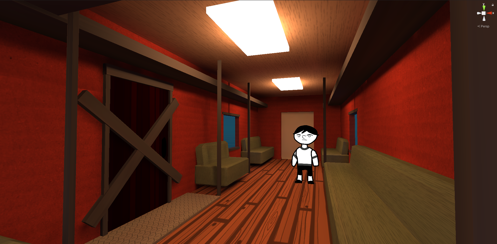

# Infinity Train

## About
<table>
<tr>
<td>
  
Originally a Scream jam project but we missed the deadline so it turned into a full project ¯\\\_(ツ)_/¯  
Scream jams are horror-themed game jams made to encourage devs to get their spook on! From straight-up scares to interactive fiction and roleplaying games, scream jams encourage all creators to try making something spooky every few months, often based upon an optional theme or season.

  (Preview)

</td>
</tr>
</table>

## Todo
- [X] Reorganize
- [X] Fix lightmap issues
- [X] Move from blender renders to pro-builder
- [ ] Map #1 / Scene #1
- [ ] Finish up train cars

## Future Features

|          Features                   |   Implementation   |
| ----------------------------------- | :----------------: |
|       Looping trains                |         ✔️         |
|  Possible flip nightmare dimension  |         ❌         |

## Prerequisites
A working computer lol

## Installation
No release date yet

## Built With

  
  

## Contributions

|  |  |  |  |
|     :---:      |     :---:      |     :---:      |     :---:      |
| [@wluxie](https://github.com/wluxie)  | [@Supernova1114](https://github.com/Supernova1114) | [@12max345](https://github.com/12max345) | [@21gomez](https://github.com/21gomez)
